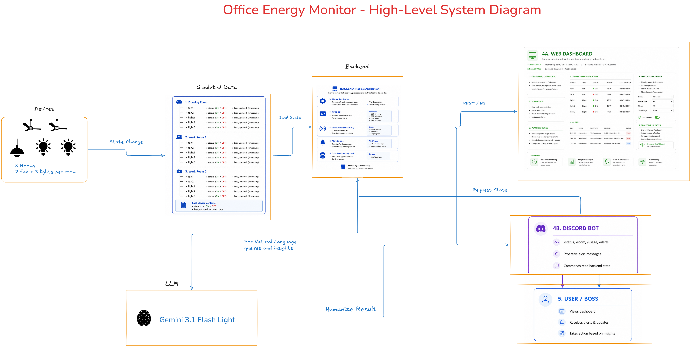

# System Architecture

## The One Rule: A Single Source Of Truth

Everything starts from `server/simulation.js`. It owns the live device state,
virtual clock, power totals, energy usage, and alerts. The web dashboard and the
Discord bot read from that same module, so the two interfaces reflect the same
data instead of maintaining separate copies.

## Components

| Layer | File | Responsibility |
|-------|------|----------------|
| Simulated devices | `server/simulation.js` | Models 15 devices across 3 rooms, advances the virtual clock, updates state, computes watts/kWh, and raises alerts. Emits `update` and `newAlert`. |
| Local persistence | `data/state.json` | Stores the latest simulated device state so it survives restarts. |
| Backend REST API | `server/api.js` | Exposes read endpoints for full state, room summaries, usage, and alerts. |
| Realtime transport | `server/index.js` | Serves the dashboard and broadcasts fresh snapshots through Socket.IO whenever simulation state changes. |
| Web dashboard | `public/` | Renders room layout, device status, power usage, and active alerts in the browser. |
| Discord bot | `server/bot.js` | Handles `!status`, `!room`, `!usage`, `!alerts`, and posts proactive alert messages when configured. |
| Optional LLM phrasing | `server/llm.js` | Uses Gemini or Groq for conversational bot replies; falls back to deterministic templates with no API key. |
| Optional cloud mirror | `server/firebase.js` | Mirrors current device status to Firebase Realtime Database for external consumers. |

## Data Flow

1. The simulator changes device state and advances the clock.
2. `simulation.js` recomputes room power, daily kWh, and active alerts.
3. `server/index.js` pushes the latest snapshot to connected dashboards through Socket.IO.
4. The browser can also fetch `/api/state`, `/api/rooms/:room`, `/api/usage`, and `/api/alerts`.
5. The Discord bot answers commands from `simulation.getState()` and `getRoomSummary()`.
6. New alerts emit `newAlert`; the bot can post them to the configured Discord channel.
7. Firebase sync optionally mirrors device statuses to the Realtime Database.

## Why This Shape

The hackathon brief needs the dashboard and bot to reflect the same live data.
Keeping the simulator, API, realtime transport, Firebase sync, and bot in one
Node.js process makes that guarantee simple: all consumers pass through the same
simulation object.
