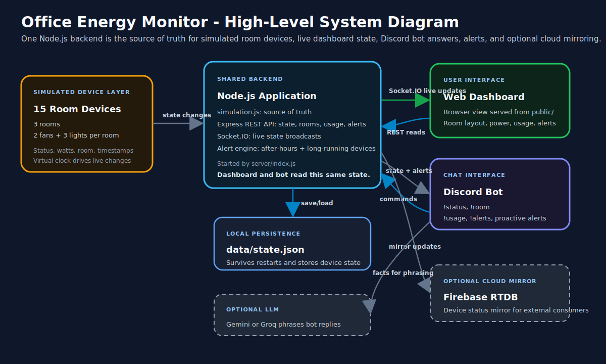

# System Architecture



> The diagram above is a hand-built SVG (open `docs/system-diagram.svg` in any
> browser). No Mermaid is used, per the brief.

## The one rule: a single source of truth

```
[Simulated Device Layer] → [Backend API] → [ Web UI ] && [ Discord Bot ]
```

Everything runs in **one Node.js process**. `server/simulation.js` holds the
only copy of device state. The web dashboard and the Discord bot are two
_readers_ of that same object, so they can never disagree.

## Components

| Layer | File | Responsibility |
|-------|------|----------------|
| Simulated devices | `server/simulation.js` | 15 devices, a controllable virtual clock, a tick loop that drifts device states, power totals, energy integration, and alert evaluation. Emits `update` / `newAlert`. |
| Backend REST API | `server/api.js` | Read endpoints (`/state`, `/rooms/:id`, `/usage`, `/alerts`). |
| Realtime transport | `server/index.js` (Socket.IO) | On every `update`, pushes a fresh snapshot to all dashboards — no page refresh. |
| Web dashboard | `public/` | Renders device panel, power meter, alerts, and an animated top-view office layout. |
| Discord bot | `server/bot.js` | `!status`, `!room`, `!usage`, `!alerts`, `!help`; proactive alert posts. Reads the same `simulation` object. |
| Conversation | `server/llm.js` | Optional Claude call to phrase bot replies like a colleague. Falls back to built-in templates when no API key is present. |

## Data flow (device → both interfaces)

1. A device state changes from the **simulator's automatic tick loop** (every 5s
   for device states, every 5s for the simulated clock).
2. `simulation` updates the device, recomputes **per-room power**, integrates
   **today's kWh**, and re-evaluates **alerts** (after-hours + room-all-on-2h).
3. It emits `update` → Socket.IO broadcasts the new snapshot → **every dashboard
   repaints instantly**.
4. Independently, the **Discord bot** answers commands by reading the exact same
   `simulation.getState()` — so a `!status` reply always matches what the
   dashboard shows.
5. When a **new alert** is raised, `simulation` emits `newAlert`; the bot posts a
   proactive heads-up to the designated channel (bonus feature).

## Why one process

The brief requires the dashboard and bot to "reflect the same live data — they
share one backend." Keeping the simulator, API, WebSocket server, and bot in a
single process makes that guarantee structural: there is literally one
in-memory object. Swapping the in-memory store for Redis/Postgres later would
not change any interface — they all go through `simulation`.
