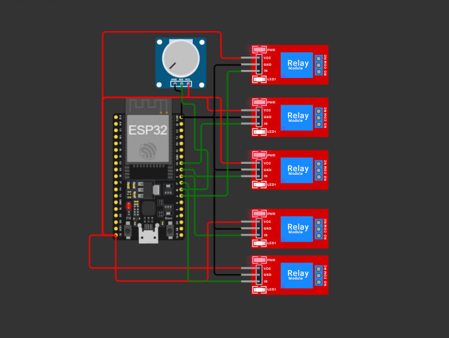

# Hardware / Electrical Schematic (concept)

This is a **simulation/concept only** — no real hardware is required for the
demo, and the running system uses simulated data. This document describes the
circuit that was built in **Wokwi**: an **ESP32** that reads each appliance's
status from **Firebase** and switches it through a **relay module**, with an
**ACS712 current sensor** (simulated by a potentiometer) measuring load current.
A representative circuit for **one room** — 2 fans + 3 lights = 5 devices — is
enough; the other two rooms are identical copies.

## Design goal

An **ESP32** is used because it has Wi-Fi to reach Firebase, plenty of GPIO to
drive the relays, and an ADC for the current sensor. Two things happen per room:

- **Control / actuation** — the ESP32 reads each device's `status` from Firebase
  and drives a **relay** that switches mains to the device. A relay physically
  clicks ON/OFF in step with the dashboard.
- **Current sensing** — an **ACS712** hall-effect sensor on the room's mains feed
  gives load current → the ADC → power in watts.

## Demo vs. real life (the important bit)

In a **real** installation the data flows **sensor → cloud → dashboard**:

- The **ACS712** measures real current draw and the ESP32 **writes** live device
  state up to **Firebase**.
- The backend / dashboard then just **read** true device state from Firebase.

For this hackathon demo we **reverse the last hop**, because Wokwi cannot
simulate real AC current through a sensor:

- The **backend generates the dynamic simulation data** (`server/simulation.js`)
  and writes it to **Firebase** (`server/firebase.js`).
- The **ESP32 reads** each device's status from Firebase and **drives the
  matching relay**.
- The **ACS712 is simulated with a potentiometer** in Wokwi — its wiper voltage
  stands in for the sensor's analog output.

So in the demo the relay module is the *consumer* of Firebase data; in real life
the ACS712 would be the *producer* of it. Everything else is unchanged.

## Bill of materials (one room)

| Qty | Part | Purpose |
|----:|------|---------|
| 1 | ESP32 DevKit v1 | controller + Wi-Fi to Firebase |
| 1 | 5-channel relay module (opto-isolated, 5 V) | switch the 5 devices |
| 1 | ACS712 (20 A) current sensor | measure room current draw |
| 1 | Potentiometer *(Wokwi stand-in for the ACS712)* | emulate the analog current signal |
| 2 | Fans (mains AC) | the 2 fans |
| 3 | Lights (mains AC) | the 3 lights |
| — | 5 V supply, jumper wires | power + wiring |

## ACS712 current sensor connection

Presented as an **ACS712 Current Sensor** (internally a potentiometer in Wokwi):

| ACS712 Pin | Connected To       | ESP32 Pin | Description                                  |
| ---------- | ------------------ | --------- | -------------------------------------------- |
| VCC        | ESP32 5V (VIN)     | VIN       | Powers the ACS712 module                     |
| GND        | ESP32 GND          | GND       | Common ground                                |
| OUT        | ESP32 Analog Input | GPIO34    | Sends analog current measurement to ESP32    |
| IP+        | AC Load Input      | —         | Current input terminal (simulated in Wokwi)  |
| IP−        | AC Load Output     | —         | Current output terminal (simulated in Wokwi) |

> **Note:** In Wokwi the ACS712 is simulated using a potentiometer because actual
> current flow through the sensor cannot be simulated. The potentiometer's output
> voltage emulates the ACS712 analog output.

## ESP32 device control mapping (Firebase → relay)

Each relay is driven by an ESP32 GPIO that follows a Firebase path (Drawing Room
shown; repeat the block per room):

| Firebase Path                | ESP32 GPIO | Relay   | Connected Appliance |
| ---------------------------- | ---------- | ------- | ------------------- |
| `Drawing Room/fan1/status`   | GPIO19     | Relay 1 | Fan 1               |
| `Drawing Room/fan2/status`   | GPIO18     | Relay 2 | Fan 2               |
| `Drawing Room/light1/status` | GPIO5      | Relay 3 | Light 1             |
| `Drawing Room/light2/status` | GPIO17     | Relay 4 | Light 2             |
| `Drawing Room/light3/status` | GPIO16     | Relay 5 | Light 3             |

## System operation

| Component                  | Function                                                                        |
| -------------------------- | ------------------------------------------------------------------------------- |
| Firebase Realtime Database | Stores the ON/OFF status of each appliance.                                     |
| ESP32                      | Reads appliance status from Firebase and controls the corresponding relay.      |
| Relay Module               | Switches the connected appliance ON or OFF.                                      |
| ACS712 Current Sensor      | Measures the load current of the connected appliance (simulated in Wokwi).      |
| Frontend Dashboard         | Displays appliance status and reflects device state driven through Firebase.    |

## Connection list

- **ESP32 5V → Relay module VCC**, **ESP32 GND → Relay GND** (set the relay
  board's JD-VCC/VCC isolation jumper per your module).
- **GPIO19/18/5/17/16 → Relay IN1..IN5** (active-LOW on most modules — drive
  LOW to energise). Each relay switches exactly one appliance.
- **Mains Live → each relay COM**; **relay NO → the device's live terminal**;
  **Neutral → device neutral** (common).
- **ACS712**: pass the room's mains **live** feed through IP+ → IP−;
  **VCC → 5V, GND → GND, OUT → GPIO34**. (In Wokwi: potentiometer ends → 3V3 /
  GND, wiper → GPIO34.)
- **Common ground**: all module grounds tie to ESP32 GND.

## Electrical reasoning

- **ESP32 for Wi-Fi + GPIO.** It reaches Firebase directly and has enough GPIO to
  drive 5 relays plus an ADC channel for the sensor, so one board covers a room.
- **Opto-isolated relay board.** The relay module's on-board optocouplers keep the
  3.3 V ESP32 logic galvanically isolated from mains — safety, and it protects the
  MCU. Relay coils have the module's built-in flyback diode.
- **Firebase as the control channel.** The ESP32 subscribes to each
  `<Room>/<device>/status` path; when the backend flips a value, the ESP32 sets the
  relay to match. This is exactly the schema `server/firebase.js` writes.
- **ADC1 for the current pin.** Wi-Fi disables ADC2, so the analog input uses
  **ADC1**. GPIO34 is input-only with no internal pull-up, ideal for the sensor /
  potentiometer. The ESP32 ADC is 12-bit over 0–3.3 V; a real ACS712 outputs
  ~2.5 V at 0 A and swings ±(66–185 mV/A), so scale it into 0–3.3 V and compute
  `P = V_mains × I_rms × PF`.
- **Separate rails.** Keep motor (fan) and MCU supplies on separate rails with a
  common ground to avoid brown-outs on inrush.

## Building it in Wokwi

Wokwi cannot model mains AC, so mock the physical devices:

- **Lights → LEDs** (with 220 Ω resistors) driven by the relay/GPIO; LED lit = ON,
  matching the dashboard's "glow when ON".
- **Fans → small DC motors** (via the relay or an NPN transistor + flyback diode);
  spinning = ON, matching the dashboard's animated fans.
- **Current sensor → a potentiometer** into GPIO34 to emulate the ACS712's analog
  output.
- Wire one room (5 devices) per the mapping above; duplicate the block for the
  other two rooms if you want the full 15.

## How the hardware maps to the software

| Hardware signal | Software field (`simulation.js` / Firebase) |
|-----------------|---------------------------------------------|
| Firebase `<Room>/<device>/status` | `device.status` (`on`/`off`) |
| Relay drive GPIO | actuates the appliance to match `status` |
| ACS712 → power calc | `device.powerW` / room `watts` |
| Firebase `last_update` | `device.lastChanged` / `onSince` |

In the live demo these signals are **simulated** in software and pushed through
Firebase, but the mapping above is exactly what a real ESP32 would run.
